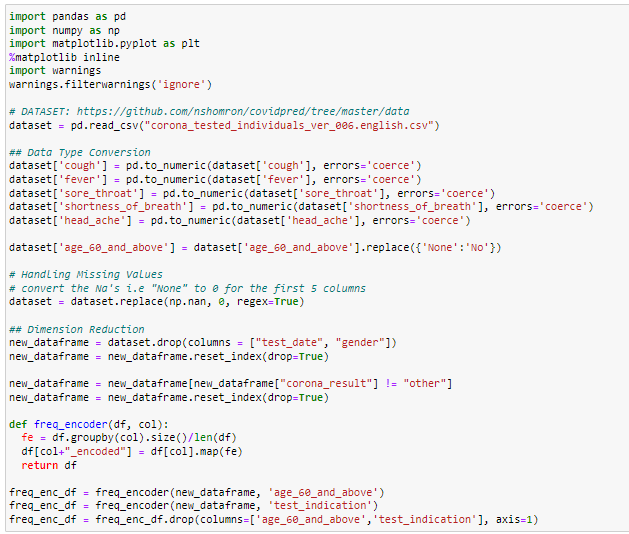
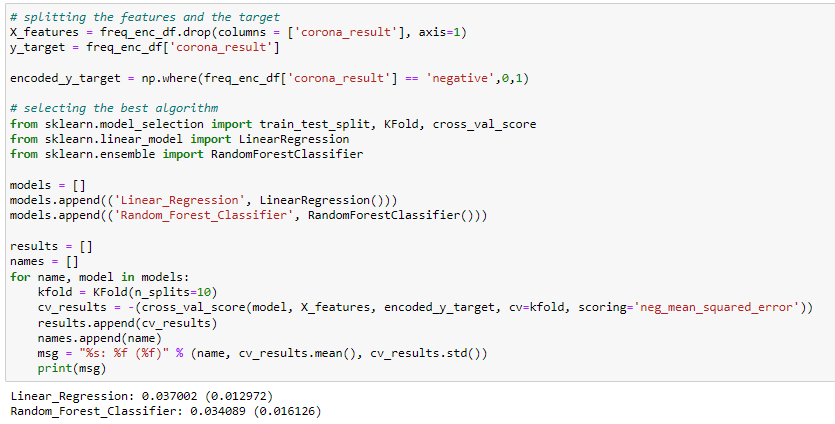
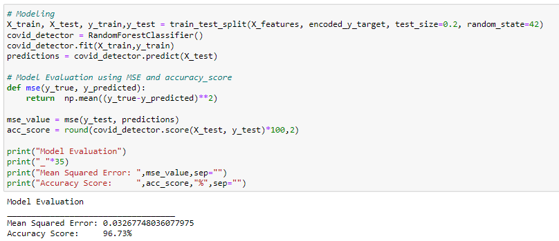
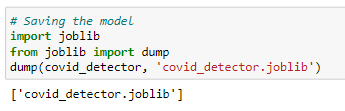
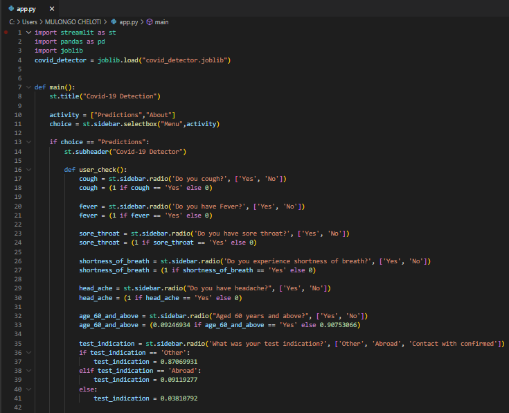
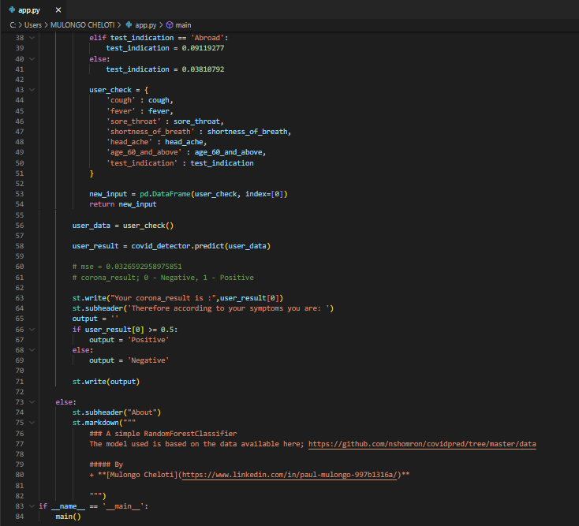
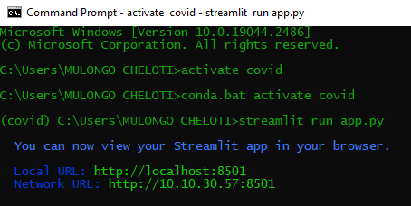

# COVID-19-PREDICTOR
---
<b>PROBLEM DEFINITION: Create an app that allows patients to input their symptoms and try to predict whether they have COVID or not.</b>

DATASET: https://github.com/nshomron/covidpred/tree/master/data

The main files are <b><a href='https://github.com/mulongocheloti/COVID-19-PREDICTOR/blob/main/Covid-19_Prediction_Model.ipynb'>.ipynb file</a>, <a href='https://github.com/mulongocheloti/COVID-19-PREDICTOR/blob/main/covid_detector.joblib'>joblib pipeline file</a></b> and <b><a href='https://github.com/mulongocheloti/COVID-19-PREDICTOR/blob/main/app.py'>streamlit application file</a></b>

---
<b>PROJECT STEPS</b>
1.  <b>SET UP</b> 
    Data Download: Downloaded the file and unzip then move it into your working directory 
    I then created an environment named <b>covid</b> and installed jupyter notebook. 
    Launched Jupyter Notebook and installed <b>pandas, numpy</b> and <b>matplotlib</b>
	 
2.  <b>DATA PREPOCESSING</b> 
    Using pandas load the dataset, do data type conversion, handle null/missing values, do dimension reduction, visualize the data. 
    Frequency encoding and split <b>features</b> from the <b>target</b> 
	 
     
3.  <b>MODEL SELECTION</b> 
    Using <b>K-Fold Cross validation</b> determine the best algorithm between <b>LinearRegression</b> and <B>RandomForestClassifier</b>. 
	 
	 
    Selected the <b>RandomForestClassifier()</b>. 
4.  <b>MODELING</b> 
    Using <b>train_test_split</b> from sklearn.model_selection we split the data into training and test sets. 
    Train the model and do the predictions. 
    Compare the predicted values to the actual values using <b>mean squared error</b>. 
	 
	 
5.  <b>CREATE A PIPELINE USING JOBLIB</b> 
    Install joblib and streamlit using !pip 
    Import joblib and save the model as <b>covid_detector.joblib</b> 
	 
	 
6.  <b>STREAMLIT APPLICATION CODE</b> 
    Now outside jupyter notebook, using streamlit code a .py file that will create a web page used for model deployment locally and save it as <b>app.py</b> 
	 
	 
	 
7.  <b>MODEL DEPLOYMENT</b> 
    Open cmd from your working directory and type as shown below 
    
	 
     
    This opens your browser and the web page is displayed 

https://user-images.githubusercontent.com/68067031/222804948-0fc7cac4-f77c-4e74-ac1a-493c3a09c578.mp4

# THANK YOU
